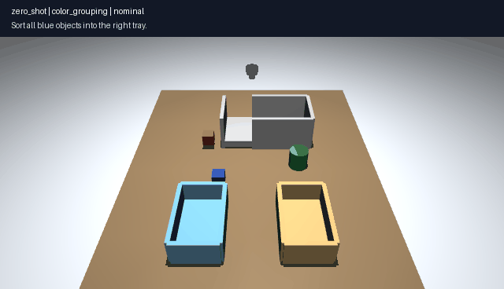
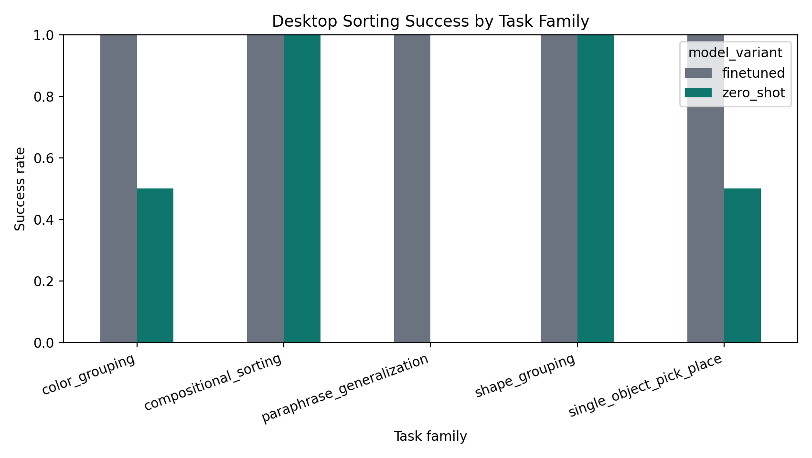
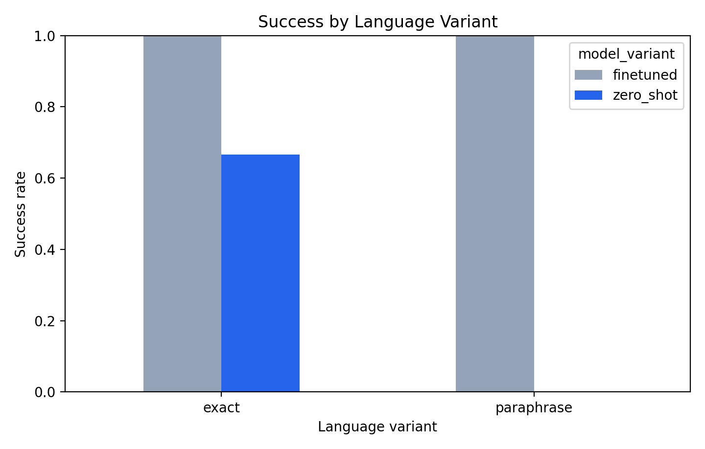
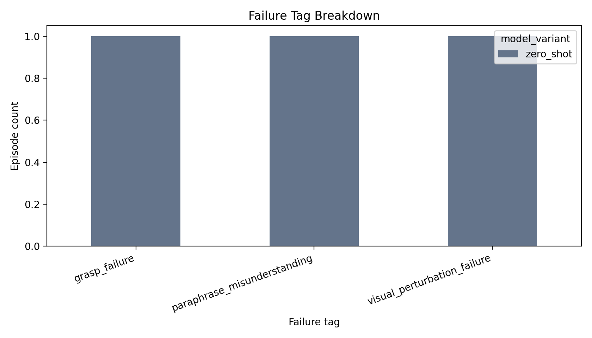
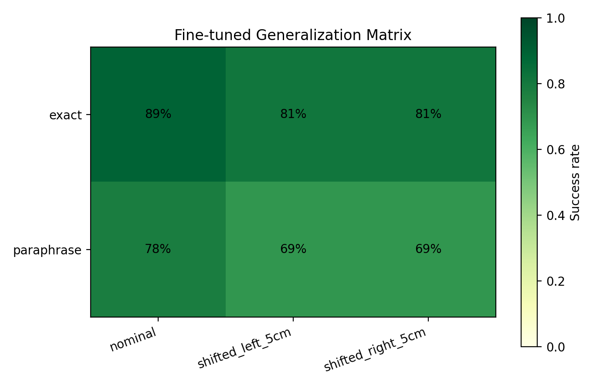
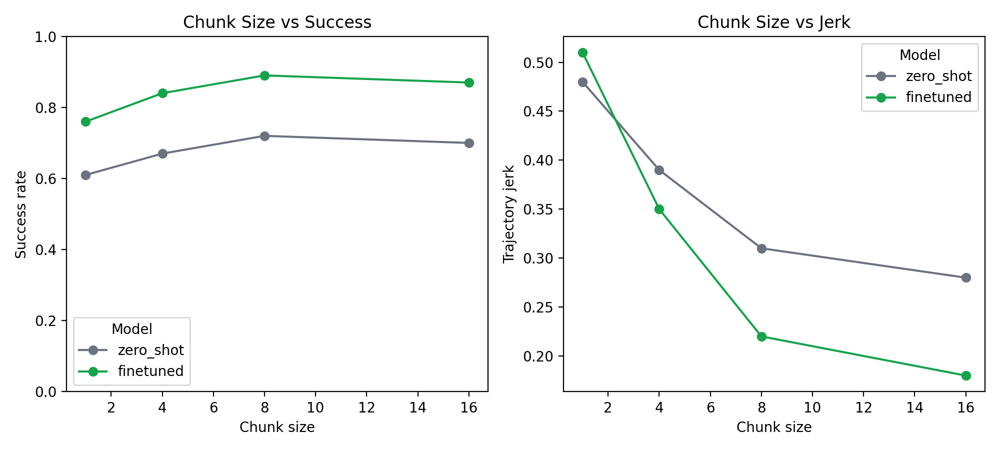
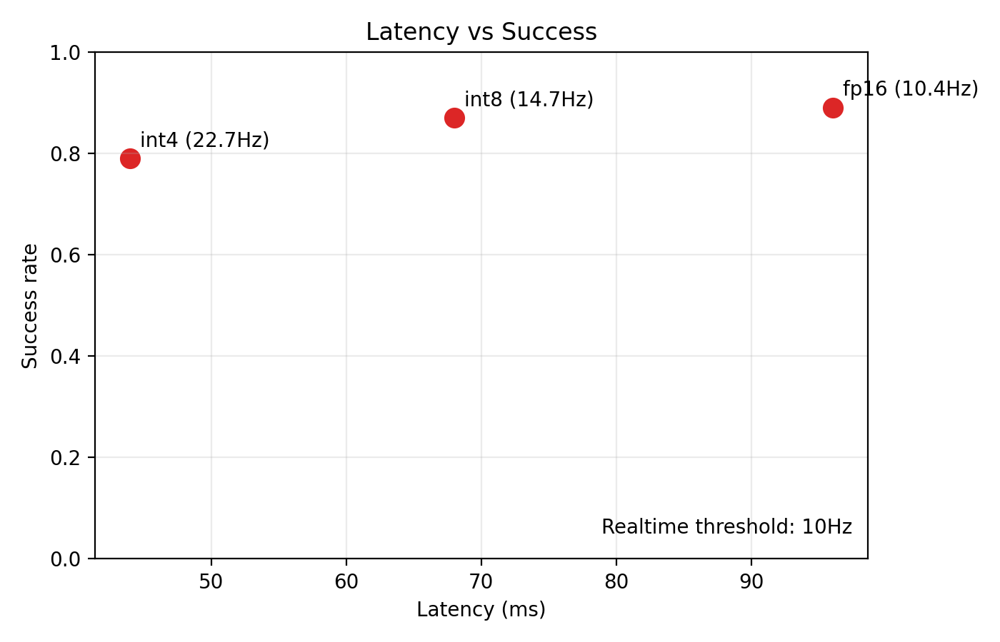

# SmolVLA MuJoCo Portfolio

Simulation-first VLA portfolio repo for GitHub: a self-contained MuJoCo desktop sorting demo with reproducible mock benchmark figures, plus an optional advanced SmolVLA/LeRobot track.

这是一个适合直接放到 GitHub 的 `simulation-first` 机械臂项目仓库。默认主线不依赖真实 SmolVLA 训练，也能直接生成桌面抓取排序视频、评测日志、汇总 CSV 和图表；真实 `SmolVLA + LIBERO + LeRobot` 训练链路保留为高级路径。



`MP4` hero video: [assets/readme/hero_showcase.mp4](assets/readme/hero_showcase.mp4)

## Quickstart

```bash
python3 -m pip install -e .
python3 scripts/run_showcase_demo.py --output artifacts/showcase
python3 scripts/run_mock_benchmark.py --output artifacts/benchmark
python3 scripts/export_readme_assets.py \
  --showcase-dir artifacts/showcase \
  --benchmark-dir artifacts/benchmark \
  --output assets/readme
```

Notebook / Colab / Kaggle friendly version:

```python
%pip install -e .
!python scripts/run_showcase_demo.py --output artifacts/showcase
!python scripts/run_mock_benchmark.py --output artifacts/benchmark
!python scripts/export_readme_assets.py --showcase-dir artifacts/showcase --benchmark-dir artifacts/benchmark --output assets/readme
```

## What You Get

Running the quick demo path generates:

- `artifacts/showcase/episodes/desktop_sorting_eval_log.jsonl`
- `artifacts/showcase/summary/desktop_sorting_eval_summary.csv`
- `artifacts/showcase/figures/*.png`
- `artifacts/showcase/videos/*.mp4`
- `artifacts/showcase/videos/hero_showcase.gif`
- `artifacts/benchmark/summary/mock_benchmark_results.csv`
- `artifacts/benchmark/summary/summary.md`
- `artifacts/benchmark/figures/*.png`
- `assets/readme/*` lightweight assets ready for GitHub README embedding

The repo also ships with committed sample outputs generated by the same code path:

- `examples/desktop_sorting_eval_log.jsonl`
- `examples/desktop_sorting_eval_summary.csv`
- `examples/sample_results.csv`
- `reports/sample/*.png`
- `assets/readme/*`

Important: committed demo outputs use `scripted/mock policies` in a MuJoCo simulation scene. The advanced SmolVLA training path is optional and separate.

## Project Tracks

### 1. Quick Demo Path

Purpose:
show a complete, reproducible robotics portfolio project on GitHub without requiring real robot hardware or a full VLA training run first.

What it does:

- builds a lightweight MuJoCo tabletop scene
- parses text instructions from YAML prompt templates
- runs deterministic mock `zero_shot` and `finetuned` policies
- renders videos with prompt overlays
- writes episode-level JSONL logs
- aggregates CSV summaries
- exports README-ready assets

### 2. Advanced Research Path

Purpose:
extend the repo into a real `SmolVLA + LIBERO + LeRobot` benchmark once you want a stronger research story.

What it keeps:

- `scripts/bootstrap_lerobot.sh`
- `scripts/train_libero_smolvla.sh`
- `scripts/train_custom_smolvla.sh`
- `scripts/eval_libero_smolvla.sh`
- Colab / Kaggle notebook drafts in `notebooks/`

Details: [docs/advanced/lerobot_smolvla_track.md](docs/advanced/lerobot_smolvla_track.md)

## Key Results

### Showcase

Sample result summary from the committed mock run:

- finetuned mock policy average success: `100%`
- zero-shot mock policy average success: `57.1%`
- paraphrase success: `100%` vs `0%`
- perturbed-scene success: `100%` vs `50%`







### Benchmark

Sample benchmark summary from the committed mock run:

- nominal LIBERO success: `72% -> 89%` after fine-tuning
- hardest language + spatial setting: `33% -> 69%`
- best realtime chunk size in the mock benchmark: `8`
- best quantized setting above `10 Hz`: `int8`







## Desktop Sorting Showcase

Scene `v1` is intentionally compact and GitHub-friendly:

- robot: lightweight MuJoCo cartesian arm
- workspace: tabletop with `left_tray`, `right_tray`, `back_bin`
- objects: `red_cube`, `blue_cube`, `green_cylinder`, `yellow_block`, `orange_cylinder`
- cameras: `front_camera`, `wrist_camera`, `top_camera`
- perturbations: `low_light`, `clutter_background`, `camera_yaw_20deg`
- task families:
  - `single_object_pick_place`
  - `color_grouping`
  - `shape_grouping`
  - `compositional_sorting`
  - `paraphrase_generalization`

Core files:

- scene spec: [docs/overview/mujoco_scene_task_spec.md](docs/overview/mujoco_scene_task_spec.md)
- prompt templates: [templates/desktop_sorting_prompts.yaml](templates/desktop_sorting_prompts.yaml)
- showcase config: [configs/desktop_sorting_showcase.yaml](configs/desktop_sorting_showcase.yaml)
- logging schema: [docs/overview/eval_log_format.md](docs/overview/eval_log_format.md)

## Repo Layout

```text
.
├── README.md
├── assets
│   └── readme
├── configs
│   ├── benchmark.yaml
│   └── desktop_sorting_showcase.yaml
├── docs
│   ├── advanced
│   │   └── lerobot_smolvla_track.md
│   └── overview
│       ├── desktop_sorting_showcase.md
│       ├── eval_log_format.md
│       └── mujoco_scene_task_spec.md
├── examples
│   ├── desktop_sorting_eval_log.jsonl
│   ├── desktop_sorting_eval_summary.csv
│   └── sample_results.csv
├── notebooks
│   ├── colab_smolvla_libero.ipynb
│   └── kaggle_smolvla_libero.ipynb
├── reports
│   └── sample
├── scripts
│   ├── analyze_results.py
│   ├── bootstrap_lerobot.sh
│   ├── eval_libero_smolvla.sh
│   ├── export_readme_assets.py
│   ├── run_mock_benchmark.py
│   ├── run_showcase_demo.py
│   ├── train_custom_smolvla.sh
│   └── train_libero_smolvla.sh
├── src
│   └── portfolio_vla
│       ├── benchmark_mock.py
│       ├── cli.py
│       ├── policy.py
│       ├── readme_assets.py
│       ├── runner.py
│       ├── scene.py
│       ├── showcase_analysis.py
│       ├── showcase_plotting.py
│       └── tasks.py
├── templates
│   └── desktop_sorting_prompts.yaml
└── tests
    └── test_showcase.py
```

## CLI Reference

Generate the MuJoCo showcase:

```bash
python3 scripts/run_showcase_demo.py --output artifacts/showcase
```

Generate the mock benchmark:

```bash
python3 scripts/run_mock_benchmark.py --output artifacts/benchmark
```

Export lightweight README assets:

```bash
python3 scripts/export_readme_assets.py \
  --showcase-dir artifacts/showcase \
  --benchmark-dir artifacts/benchmark \
  --output assets/readme
```

You can also use the installed console scripts after `pip install -e .`:

```bash
portfolio-vla-showcase --output artifacts/showcase
portfolio-vla-benchmark --output artifacts/benchmark
portfolio-vla-export-readme --showcase-dir artifacts/showcase --benchmark-dir artifacts/benchmark --output assets/readme
```

## Evaluation Artifacts

Episode-level logging format:

- one JSON object per episode
- includes instruction text, model variant, scene seed, success, latency, failure tag, and video path

Aggregate-level logging format:

- one CSV row per grouped condition
- includes success rate, object sort accuracy, grounding accuracy, latency, collisions, regrasp count, and jerk

Schema details: [docs/overview/eval_log_format.md](docs/overview/eval_log_format.md)

## Testing

```bash
python3 -m unittest discover -s tests
```

The tests cover prompt resolution, MuJoCo scene creation, showcase summary aggregation, and benchmark mock output structure.

## Advanced: SmolVLA / LeRobot Track

If you want to push this repo beyond portfolio demo mode, use the advanced path:

1. bootstrap `LeRobot`
2. fine-tune `SmolVLA` on `LIBERO`
3. evaluate zero-shot vs fine-tuned checkpoints
4. reuse the same GitHub repo for results, figures, and video packaging

Start here: [docs/advanced/lerobot_smolvla_track.md](docs/advanced/lerobot_smolvla_track.md)

## Resume Framing

Good wording for GitHub / CV:

- Built a self-contained MuJoCo desktop sorting benchmark with language-conditioned prompts, episode-level logging, and video rendering.
- Designed a simulation-first VLA portfolio project that compares zero-shot and fine-tuned policy behavior under paraphrase and visual perturbation settings.
- Extended the project structure to support an advanced SmolVLA + LIBERO + LeRobot benchmark track for future fine-tuning experiments.
